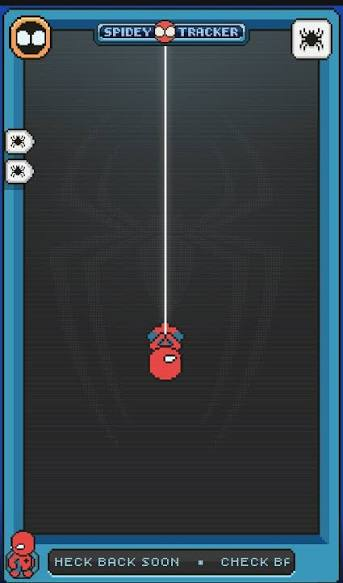

# Horus-android-comic-reader (Paused)
android comic reader writted on c++ and kotlin by using libarchive as base for cbr, cbz and pdf that decompress files to ram by using libarchive

# About pause
the project is on pause cause i just enter on third year of secondary school (idk know if it's written correctly but on spanish is on tercero de secundaria) and the teachers gave me a bit of homework and i don't have nothing of the project code because I'm so Lazy and tiktok Made me hipnotized so in one or two weeks i Will continue with the code besides I'm going to use less Tiktok 

i can't show a picture of the program 'cause i'm just starting on the project but my idea is to make it look like the spidey-tracker from Spider-Man Brand New Day movie

# project phases
the project has 4 phases.

**1. Engine.** the file that makes possible to read the files

**2. Try the engine on kitty terminal.** after create the engine do a test of it by using kitty img protocols and base64

**3. adapting the motor to JNI.** just adapt the motor to work with jni and kotlin

**4. Make a good graphical user interface (GUI).** just create the look of the app

# Current project status
the project is currently on phase 1.

The engine will be approximately in one or three weeks 'cause I'm so lazy and I need to learn more about pointers and malloc also I want to finish watching X-men'97.

The program will be finished in three months or more 'cause it's a very big from the place that I'm right now mostly because I have approximately 2 months on C++.
But anyway I want to do this program even though I know it's going to be very complex and stressful for me
